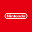

<h1>
  
  <span style="color: #e92841;">Gamelist</span>
</h1>

Gamelist is a personal game backlog, preorder, price, trophy, achievement, and physical collection tracker. It runs as a self-hosted static frontend served by a Cloudflare Worker, with saved data stored in Cloudflare KV.

The app has two connected pages:

-  `/` for the main game backlog, preorder, release, and completion status tracker.
-  `/shelf` for the physical collection tracker and organizer.

Pull down the top bar/handle to go to the other page!

Both pages share edit mode, themes, account settings, price-store settings, achievement integrations. Shelf Sync can also send physical collection additions back into the main Gamelist flow and in reverse when you add a new game to your backlog.

Made and designed by  [Shabii](https://x.com/Shabii_exe) with the help of ChatGPT Codex.

<blockquote>
  <strong>Suggestions, questions, updates, new features, or patches:</strong><br>
  Email <a href="mailto:shabiimitjans@gmail.com"><code>shabiimitjans@gmail.com</code></a>
</blockquote>

## Features

- Cloud sync through Cloudflare Workers.
- Backlog, upcoming, available, currently playing, and finished-game boards.
- Release calendar with preorder markers.
- Physical Shelf library with multiple owners, regions, conditions, categories, selected-store prices, PriceCharting collection values, and linked Gamelist entries.
- Game of the year tracking and shareable image export.
- IGDB-powered lookup for all game covers, release dates, descriptions, genres, developers, publishers, trailers, store links, and price-search helpers.
- Twitch stream preview in Currently Playing when a streamed game and Twitch username are configured.
- Shelf Showcase block for featured games, plus shared Currently Playing, Last Finished, Highlights, and Search modules.
- PSN, Steam, and Xbox trophy/achievement dashboards.
- Google Calendar preorder events when configured.
- Theme editor with dark/light mode, colors, logos, title styles, and module ordering.
- CSV import/export for Gamelist and Shelf data.
- Mobile-ready responsive layout for phone, tablet, and desktop use.

---

<h1>
  
  <span style="color: #e92841;">How To Setup Your Own Gamelist</span>
</h1>

This is the main setup path. You do not need to download a ZIP or run terminal commands. Cloudflare can import the public GitHub repository URL directly from the dashboard and automatically setup your own personal copy for you, for free.

#### Setup requirements

-  A Cloudflare account, to host your site.
-  A GitHub account to host your site files.
-  A Twitch account to access the IGDB api and get all the game data.

The setup is simple, it will take you under an hour to fully set up with the required steps. If you want to also have all the extras, it will be just under 2 hours total to fully set up the rest. But, then adding your games is a whole other story... Enjoy keeping track of your games, plan your next playthroughs, and more than anything, enjoy the hobby!

Your default Gamelist site url will be **gamelist.\***email_username**\*.workers.dev** You can change it later with a custom domain if wanted.

### 1. Start from Cloudflare

1. Open the [Cloudflare dashboard](https://dash.cloudflare.com/).
2. Go to **Workers & Pages**.
3. Click **Create application**.
4. Click **Continue with GitHub**.
5. Choose **Import a repository**.
6. Choose **Clone a public repository via GitHub URL**.
7. Add this repository URL:

```text
https://github.com/ShabiiEXE/Gamelist
```

8. Continue with the imported repository.
9. If Cloudflare sends you to GitHub, set up or sign in to your GitHub account and allow the connection.
10. Keep the default settings and click **Deploy**.
11. Once deployed, open **Overview** in the nav bar and click **Visit** to open your site.
12. If the **Visit** button is not available, open **Domains** in the nav bar and enable both URLs.
13. After your site opens, continue to **Automatic Updates** below if you want to add update sync.

### 2. Set your password to access settings (Adding Secrets in Cloudflare)

In the Worker project settings, add your secrets through the Cloudflare website:

1. Open the [Cloudflare dashboard](https://dash.cloudflare.com/).
2. Go to **Workers & Pages**.
3. Open your Gamelist Worker.
4. Open **Settings**.
5. Open **Variables and Secrets**.
6. Click **Add**.
7. Choose **Secret** for passwords, API keys, and tokens.
8. Enter the variable name exactly as shown below.
9. Paste the value.
10. Deploy/Save.

Add this required secret first:

```text
EDIT_PASSWORD
```

`EDIT_PASSWORD` is the password you will type in the app to unlock edit mode and change your site settings and theme.

Use **Secret** for all integration keys/tokens. Do not put them in `wrangler.toml`, do not commit them to GitHub, and do not share them publicly.

Now **continue** the setup until you reach **Recommended Integrations**. The next integrations are **required** to make it all work properly, but the recommended ones will help you improve your experience a bit more.

### 3. Add game search and auto-fill

Game lookup requires integrating with IGDB.
IGDB authentication uses Twitch developer credentials:

1. Open the [Twitch Developer Console](https://dev.twitch.tv/console).
2. Log in with a Twitch account.
3. Make sure the account has email verification and 2FA enabled.
4. Go to **Applications**.
5. Click **Register Your Application**.
6. Use any app name, for example `Gamelist`.
7. Use `https://localhost` as the OAuth Redirect URL.
8. Set the category to **Website Integration**.
9. Set client type as **Confidential**.
10. Create the app.
11. Click the manage button on the Application you just created.
12. Copy the **Client ID** and create a new **Cloudflare secret**:

```text
IGDB_CLIENT_ID
```

11. Click generate new secret and copy the **Client Secret** and create another **Cloudflare secret**:

```text
IGDB_CLIENT_SECRET
```

### 4. Set up the automatic website updates/patches

To receive upcoming Gamelist feature updates, add the GitHub Actions sync workflow to your repository.

1. Once the setup is done, go to your newly added GitHub repository.
2. Go to **Actions**.
3. Click **set up a workflow yourself**.
4. Make sure the default file name is:

```text
main.yml
```

5. Then open this link [main.yml](https://github.com/ShabiiEXE/Gamelist/blob/main/.github/workflows/main.yml) to the workflow action file from the main Gamelist repository.
6. Copy the code from that file using to copy button on the top right or manually select all and copy.
7. Paste it into the empty workflow text box.
8. Commit the changes.
9. Go back to **Actions**.
10. Open **Sync from upstream**.
11. Enable the workflow if GitHub asks.
12. Click **Run workflow** once to test it.

To force an update manually later, open your repository, go to **Actions**, open **Sync from upstream**, and click **Run workflow**.
For now, let's finish this setup.

13. Go back to your repository **Code page** (Main page) and next to about press the cog button.
14. Inside the website text box add your website url

15. Open [GitHub fine-grained personal access tokens](https://github.com/settings/personal-access-tokens).
16. Click **Generate new token**.
17. Use a clear name, for example `Gamelist Cloudflare updater`.
18. Under **Resource owner**, choose the GitHub account that owns your Gamelist repository.
19. Set **No expiration** as the expiration date.
20. Under **Repository access**, choose **Only select repositories**.
21. Select only your Gamelist repository. Do not select any other repositories.
22. Under **Repository permissions**, **Add permissions** and check **Actions** and change it to **Read and write**.
23. Click **Generate token**.
24. Copy the token immediately. GitHub will not show it again.
25. Add it in Cloudflare **Variables and Secrets** as a **Secret**:

```text
GITHUB_WORKFLOW_TOKEN
```

## Recommended integrations

###  PlayStation Trophies

1. Log into your [PlayStation](https://www.playstation.com/) account.
2. In the same browser, open the [Sony SSO cookie page](https://ca.account.sony.com/api/v1/ssocookie).
3. Copy only the long `npsso` token value from the JSON response.
4. Add it to Cloudflare **Variables and Secrets** as:

```text
PSN_NPSSO
```

5. Set your **PlayStation profile name** inside the app: enter edit mode, open **Settings**, and fill the PlayStation account field.

The Playstation API access can expire after a while and will require adding the `npsso` token value again, if that is the case.

###  Steam Achievements

1. Enter [Steam Web API key page](https://steamcommunity.com/dev/apikey) and log into your account.
2. Copy the key and create a new Cloudflare **Variables and Secrets** entry:

```text
STEAM_API_KEY
```

3. Set your **Steam account** inside the app: enter edit mode, open **Settings**, and fill the **Steam account** field with a SteamID64, Steam profile URL, or vanity name.

Steam achievements are fetched only for app IDs owned by the configured Steam account. Make sure the account's game details and library visibility are set to **Public**.

###  Xbox Achievements

Xbox 360, Xbox One, Xbox Series, and Xbox PC games can show achievements through OpenXBL.
1.Register on [OpenXBL](https://xbl.io/), create a personal API key in the dashboard, then add it as a Cloudflare secret:

```text
OPENXBL_API_KEY
```

2.Set your **Xbox account** inside the app: enter edit mode, open **Settings**, and fill the **Microsoft account** field with an Xbox gamertag or XUID.

###  Google Calendar Preorder Events (ADVANCED)

When you mark a game with a release date as preordered, the Worker can add an all-day Google Calendar event named `Preorder "Game Name"`.

1. Create a new Calendar in your Google Calendar.
2. Set up a [Google Cloud](https://console.cloud.google.com/) service account with Google Calendar API access, then share the target calendar with the service account email generated with permission to make changes.

3. Add the created service account email address as a Cloudflare **Variables and Secrets** entry:

```text
GOOGLE_SERVICE_ACCOUNT_EMAIL
```

4. Add the `private_key` value from the service account JSON as another **secrets** entry:

```text
GOOGLE_PRIVATE_KEY
```

5. Add this service account email to your calendar and give it all the permissions.

6. Add the calendar ID from the calendar you are using as a **secrets** entry. You can get this from your calendar settings after:

```text
GOOGLE_CALENDAR_ID
```

---

##  First run

1. Deploy the Worker.
2. Open the site.
3. Click edit/login and enter `EDIT_PASSWORD`.
4. Open Settings.
5. Set currency, region, selected shops, default owner, account names, theme, Shelf Sync, and visible sections.
6. Save settings.

Those settings are stored in the Worker KV namespace.

### Available store prices data

Store prices use your selected **region**, **currency**, and **selected shops** from Settings. You can choose up to five physical stores at once.

Physical store price options:

-  Different Amazon regional prices from Amazon.es, Amazon.co.uk, or Amazon.com, etc .depending on the users selected prefered region.
-  eBay prices from different users listings.
-  GAME.es prices, including second hand.
-  Xtralife prices.
-  Retro Island NY prices.
-  US GameStop prices, including second hand.
-  US Walmart prices.

Digital games use the platform store automatically when the platform matches:

-  Different Nintendo regional for Nintendo Switch / Switch 2 digital games.
-  Different PlayStation Store regional prices for PS4 / PS5 digital games .
-  Different Steam regional prices.
-  Different regional Xbox Store or Xbox PC games.

 Shelf collection values also use PriceCharting data when a matching physical game from the collection, to track the average market value depending on the condition.

### Twitch stream preview

The Currently Playing carousel can show a Twitch preview card before the games.

To enable it:

1. Enter edit mode.
2. Open **Settings**.
3. Add your Twitch username in the platform/account settings.
4. Mark at least one currently-playing game as **Stream**.
5. Save settings.

When those are both set, Gamelist and Shelf add a Twitch preview as the first carousel item. If the channel is live, it embeds the current stream. If the channel is offline, it tries to show the latest saved stream instead. The card links directly to the configured Twitch channel.

##  Common tasks

### Add a game to your gamelist

1. Enter edit mode.
2. Click **Add Game**.
3. Search by title or paste an IGDB game URL.
4. Choose the place it should be in: Backlog, Upcoming, Available.
5. Add platform, owners, preorder store, release date, store links, Steam App ID, trophy name, cover, and notes as needed.
6. Save.

If Google Calendar is configured, adding a new preorder store to an upcoming/wanted game with a release date can create a preorder calendar event.

### Add a a physical game to your Shelf collection

1. Click the **top handle** or drag it down to access the **Shelf**.
2. Enter edit mode.
3. Click **Add Game**.
4. Search by title, paste a PriceCharting url, paste a IGDB url or enter details manually.
5. Set platform, region, owners, condition parts, collection value fields, publisher/developer, genre, cover, and notes.
6. Save.

New physical games can sync into the Gamelist as setup-needed backlog/new-addition entries when Shelf Sync is enabled.

### Create your end of year GOTY image

During December and January, Gamelist let's you pickyour yearly **Games of the year** and besides checking your statistics, it will let you turn it into a shareable image using your current theme and logo.

1. Enter edit mode.
2. Go to the **Games of the year** section.
3. Make sure the current year picks are chosen or go to the dropdown and select a previous year.
4. Export the image using the **download button**.

The export follows your active theme styling.

If you have a Twitch username set in Settings, the poster footer can include your Twitch channel link alongside the site link.

### Import and Export your data as CSV

Both pages have **Your data** controls at the bottom of Settings, after Store selection.

- **Gamelist games** exports/imports the digital backlog and finished game list.
- **Shelf physical games** exports/imports the physical collection.
- **GOTY** exports/imports saved Games of the year picks by year and category.
- **Finished games** exports/imports the completed-game fields that power the yearly stats views.
- Arrays and objects, such as owners, tags, store links, prices, and metadata, are preserved as JSON text inside CSV cells.

This can allow you to safely create a backup of your collection and data.
